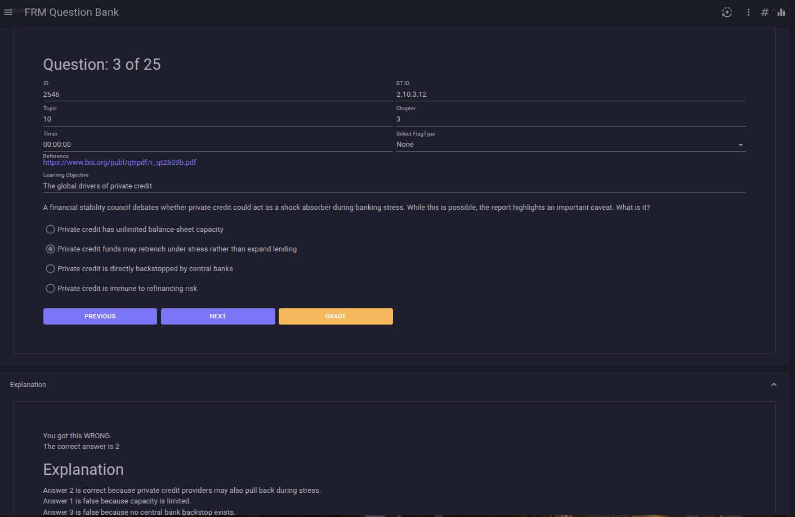
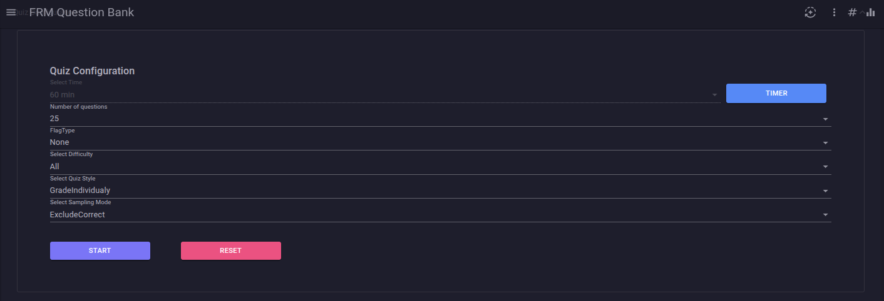
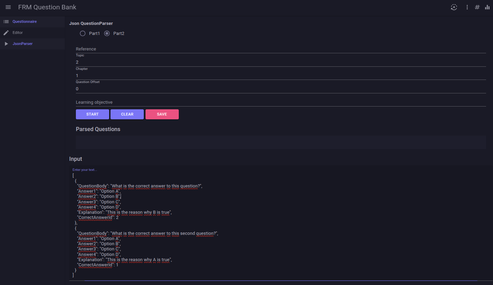
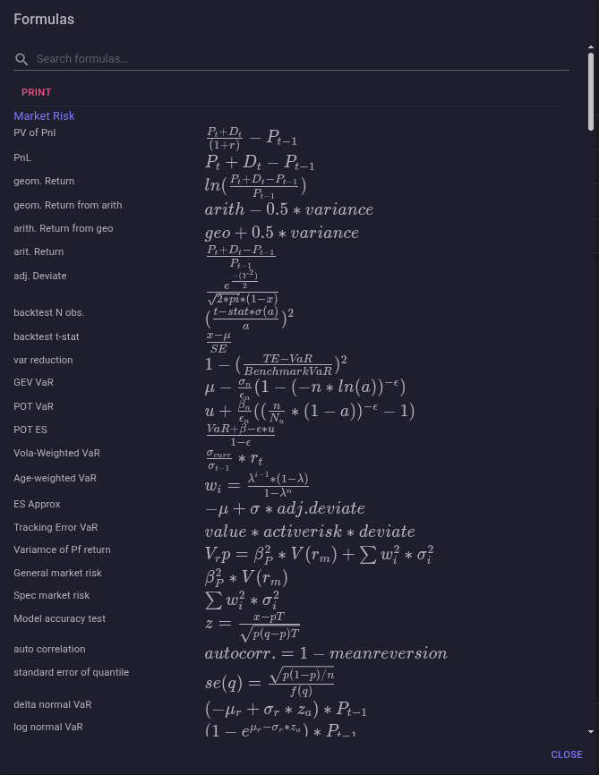

# 📘 FRM QuestionBank (.NET 9, EF Core, MudBlazor)

A lightweight, extensible questionnaire engine built with **.NET 9**, **EF Core (SQLite)**, **MudBlazor**, **Microsoft Identity**, and **Serilog**.  
The project supports dynamic question loading via **JSON**, persistent storage via **SQLite**, and a clean UI powered by MudBlazor.

---

## 📸 Screenshots


### 🧩 Questionnaire Setup


### ⚙️ Configuration UI


### 📄 JSON Question Parsing



### Z-Table


### Formulas

---

## 🚀 Features

- Dynamic questionnaire engine with JSON‑based question definitions
- SQLite storage using Entity Framework Core
- MudBlazor UI for clean, responsive components
- Optional Azure AD authentication
- Serilog structured logging
- Docker‑ready (Linux default target OS)
- .NET 9 minimal hosting model

---

## 📦 Tech Stack

| Component | Version | Purpose |
|----------|---------|---------|
| .NET | 9.0 | Web backend & hosting |
| EF Core | 9.0.11 | ORM & migrations |
| SQLite | 9.0.11 | Lightweight DB |
| MudBlazor | 8.14.0 | UI components |
| Microsoft.Identity.Web | 4.1.1 | Authentication |
| Serilog | 10.0.0 | Logging |

---
## 🧠 Generating Question Sets Using Copilot (from PDFs)

The application supports importing question sets in JSON format.  
To streamline content creation, you can use **Microsoft Copilot** (or any GPT‑based assistant) to automatically generate questions from publicly available research papers, reports, or your own uploaded PDFs.

### 🔧 How to Generate Questions with Copilot

1. Open Copilot (web, desktop, or integrated version).
2. Upload the PDF you want to base your questions on.
3. Use the following prompt to generate a complete question set in the correct JSON format:
```text
Use this PDF and create 20 questions in json format like:

[
  {
    "QuestionBody": "What is the correct answer to this question?",
    "Answer1": "Option A",
    "Answer2": "Option B",
    "Answer3": "Option C",
    "Answer4": "Option D",
    "Explanation": "This is the reason why B is true",
    "CorrectAnswerId": 2
  }
]

with:
- almost balanced answerids,
- 3 sentences context in questionbody
- good explanation with at least two sentences
- explanations in "explanation" why the other options are false
- with mixed-difficulty sets
- add line break between the answer explanations eg: Answer 2 is correct because.... <br> Answer 1 is false because...
- use 1,2,3,4 as answer ids
```
4. Copy the generated JSON output.

---

### 📥 Importing the Generated Questions

1. Open the **Question Bank** section in the application.
2. Select **Upload JSON**.
3. Choose the JSON file generated by Copilot.
4. The system validates the structure and imports the questions into the local database.

---

### 💡 Typical Use Cases

This workflow allows you to quickly create question sets based on:
- financial‑market research papers
- regulatory publications
- academic articles
- internal training material

The tool does **not** store or redistribute the PDF itself — only your generated JSON question set.
